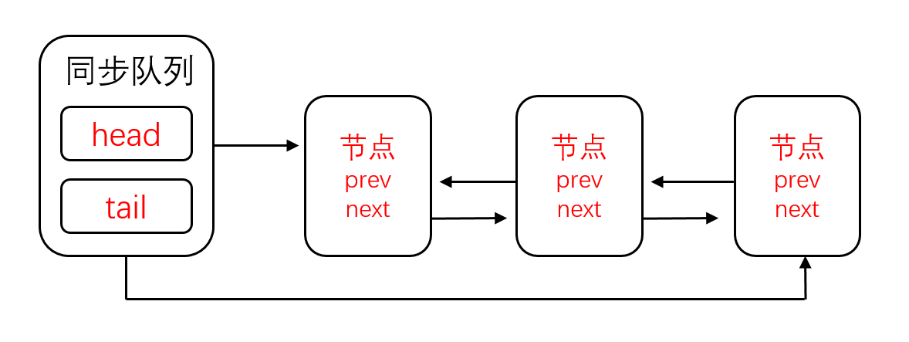

### AbstractQueuedSynchronizer
　　AbstractQueuedSynchronizer，AQS 即队列同步器。它是一个框架，用来构建锁或其他同步组件的基础框架，使用方法是继承，即子类通过继承同步器并实现它的抽象方法来管理同步状态，通过内置的先进先出（FIFO）队列来完成资源获取线程的排队工作，使用到 AQS 的子类有 [ReentrantLock]()、[Semaphore]()、[CountDownLatch]() 等。 <br />
　　同步器提供的三个方法来获取和修改同步状态，getState()、setState(int newState) 和 compareAndSetState(int expect, int update) 这三个方法能够保证状态的改变是安全的。<br />
　　AQS 框架用到了模板方法模式，部分方法交由子类实现，**AQS 框架简化锁的实现方式，负责管理同步状态、线程的排队、等待与唤醒线程，子类继承 AQS，只需实现模板方法中的同步方法。** 比如 [acuqire](https://github.com/martin-1992/Java-Lock-Notes/blob/master/AQS%20%E6%A1%86%E6%9E%B6%E5%8D%B3%E5%85%B6%E5%AD%90%E7%B1%BB%E6%BA%90%E7%A0%81%E5%88%86%E6%9E%90/%E7%8B%AC%E5%8D%A0%E5%BC%8F%E9%94%81/acquire.md) 独占锁方法，子类只需实现 tryAcquire 方法，其他流程，如获取同步状态失败，将当前线程包装成节点，添加到队列中则由 acuqire 方法实现。即子类继承 AQS 框架重写指定的方法（如 tryAcquire），在调用同步器的模板方法（如 acuqire），则会调用子类重写的方法（tryAcquire）。<br />
 　　AQS 框架提供的模板方法分为三类：独占式锁的获取和释放、共享式锁的获取和释放、查询同步队列中的等待线程。

```java
// 独占式获取同步状态，获取同步状态成功后，其他线程需要等待该线程释放同步状态才能获取同步状态，同步状态即为锁
protected boolean tryAcquire(int arg) {  
    throw new UnsupportedOperationException();  
}  

// 独占式释放同步状态
protected boolean tryRelease(int arg) {  
    throw new UnsupportedOperationException();  
}  

// 共享式获取同步状态，返回值大于等于 0 则表示获取成功，否则获取失败
protected int tryAcquireShared(int arg) {  
    throw new UnsupportedOperationException();  
  
}  

// 共享式释放同步状态
protected boolean tryReleaseShared(int arg) {  
    throw new UnsupportedOperationException();  
```  

　　在基于 AQS 构建的同步器中，只能在一个时刻发生阻塞，从而降低上下文切换的开销，提高吞吐量。同时在设计 AQS 时充分考虑了可伸缩性，因此 J.U.C 中所有基于 AQS 构建的同步器均可以获得这个优势。同时 CAS 在获取同步状态时实现多种方式：
  
- 独占锁和共享锁机制；
- 线程阻塞后，如需要取消，支持中断；
- 线程阻塞后，如有超时要求，支持超时后中断。

　　**AbstractQueuedSynchronizer 会把所有的请求线程构成一个 CLH 队列，每个线程包装成一个节点，只有一个时刻发生阻塞，降低上下文切换的开销。** 当一个（节点）线程执行完毕（lock.unlock()）时会激活自己的后续节点（线程）。<br />
　　注意，只有获取不到同步状态（锁）的线程，才会进入被包装成节点进入阻塞状态，而正在执行的线程不再队列中。一个同步器至少需要包含两个功能：

- 获取锁。如果允许，则获取锁，如果不允许就阻塞线程，直到同步状态允许获取；
- 释放锁。修改同步状态，并且唤醒等待线程。

### [同步状态 state](https://github.com/martin-1992/Java-Lock-Notes/blob/master/AQS%20%E6%A1%86%E6%9E%B6%E5%8D%B3%E5%85%B6%E5%AD%90%E7%B1%BB%E6%BA%90%E7%A0%81%E5%88%86%E6%9E%90/AbstractQueuedSynchronizer/state.md)
　　AQS 使用一个 int 类型的成员变量 state 来表示同步状态（锁），**所有继承 AQS 框架的类，对锁的操作本质是通过修改 state 来实现，** 比如修改 state = 0，即释放锁。修改 state = 1，则获得锁。

### 同步队列
　　同步队列是一个 FIFO 双向队列，AQS 通过它来完成同步状态的管理。当前线程获取同步状态失败时，AQS 会将当前线程以及等待状态等信息构造成一个节点（Node），并将其加入到同步队列，同时会阻塞当前线程。当同步状态释放时，会把首节点中的线程唤醒（公平锁），使其再次尝试获取同步状态（锁）。<br />
　　在同步队列中，一个节点表示一个线程，节点保存着获取同步状态（锁）失败的线程引用（thread）、等待状态（waitStatus）、前节点（prev）、后节点（next）。

#### [节点 Node](https://github.com/martin-1992/Java-Lock-Notes/blob/master/AQS%20%E6%A1%86%E6%9E%B6%E5%8D%B3%E5%85%B6%E5%AD%90%E7%B1%BB%E6%BA%90%E7%A0%81%E5%88%86%E6%9E%90/AbstractQueuedSynchronizer/node.md)
　　通过节点构成同步队列，如下图，同步队列是拥有头节点和尾节点的链表，遵循先进先出原则。<br />
　　头节点是获取同步状态成功的节点，头节点的线程在释放同步状态时，将会唤醒后续节点，而后续节点在获取同步状态成功时，会将自己设置为头节点。



### [addWaiter](https://github.com/martin-1992/Java-Lock-Notes/blob/master/AQS%20%E6%A1%86%E6%9E%B6%E5%8D%B3%E5%85%B6%E5%AD%90%E7%B1%BB%E6%BA%90%E7%A0%81%E5%88%86%E6%9E%90/AbstractQueuedSynchronizer/addWaiter.md)
　　获取锁失败后，执行该方法，**将当前无法获得锁的线程包装为一个节点 Node，使用 compareAndSetTail 添加到同步队列尾部，** expect 为传入当前线程认为的尾节点，update 为要添加的节点。

