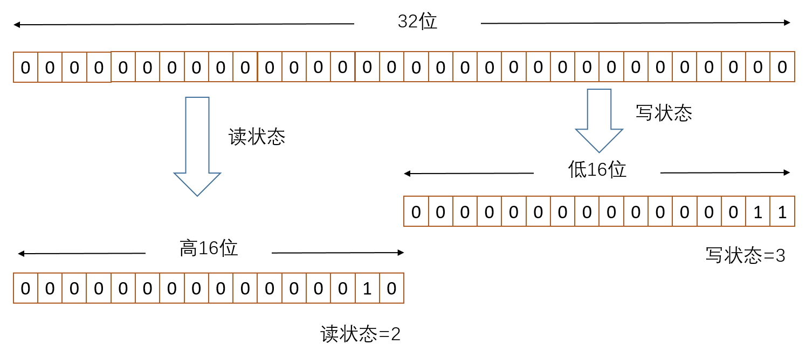

## ReentrantReadWriteLock
　　ReentrantReadWriteLock 为读写锁，同一时刻允许多个读线程访问，但在写线程访问时，所有的读线程和其他写线程均被阻塞。读写锁维护一对锁，一个读锁和一个写锁。<br />

### 读写状态的设计
　　AQS 框架的同步状态是一个整型变量，为了在一个整型变量上维护读锁和写锁，于是 “按位切割使用” 这个变量，如下图，将 32 位的整型变量切成两部分，高 16 位表示读锁，低 16 位表示写锁。



```java
    abstract static class Sync extends AbstractQueuedSynchronizer {
        private static final long serialVersionUID = 6317671515068378041L;

        // 写锁和读锁的常量
        static final int SHARED_SHIFT   = 16;
        static final int SHARED_UNIT    = (1 << SHARED_SHIFT);
        static final int MAX_COUNT      = (1 << SHARED_SHIFT) - 1;
        static final int EXCLUSIVE_MASK = (1 << SHARED_SHIFT) - 1;

        // 读锁，当前同步状态为 c，读状态为 c >>> 16
        static int sharedCount(int c)    { return c >>> SHARED_SHIFT; }
        // 写锁，当前同步状态为 c，写状态为 c & ((1 << SHARED_SHIFT) - 1)，即 c & 0x0000FFFF
        static int exclusiveCount(int c) { return c & EXCLUSIVE_MASK; }
        // ...
}
```

### [WriteLock](https://github.com/martin-1992/Java-Lock-Notes/blob/master/AQS%20%E6%A1%86%E6%9E%B6%E5%8D%B3%E5%85%B6%E5%AD%90%E7%B1%BB%E6%BA%90%E7%A0%81%E5%88%86%E6%9E%90/%E5%AD%90%E7%B1%BB%E5%AE%9E%E7%8E%B0/ReentrantReadWriteLock/WriteLock.md)
　　写锁是一个支持重进入的排它锁。

- 如果当前线程没有获取写锁，且当前线程获得读锁或其他线程获得读写锁，则当前线程包装成节点添加到同步队列末尾；
- 如果当前线程获得写锁，则增加写状态。

　　如果存在读锁，则写锁不能获取，因为读写锁要确保写锁的操作对读锁可见。如果允许在已获取读锁的情况下，再获取写锁，**那么正在运行的其他读线程就无法感知到当前写线程的操作，会出现数据库中的脏读、幻读这些，这也是为什么读锁不能升级为写锁的原因。**

### [ReadLock](https://github.com/martin-1992/Java-Lock-Notes/blob/master/AQS%20%E6%A1%86%E6%9E%B6%E5%8D%B3%E5%85%B6%E5%AD%90%E7%B1%BB%E6%BA%90%E7%A0%81%E5%88%86%E6%9E%90/%E5%AD%90%E7%B1%BB%E5%AE%9E%E7%8E%B0/ReentrantReadWriteLock/ReadLock.md)
　　
