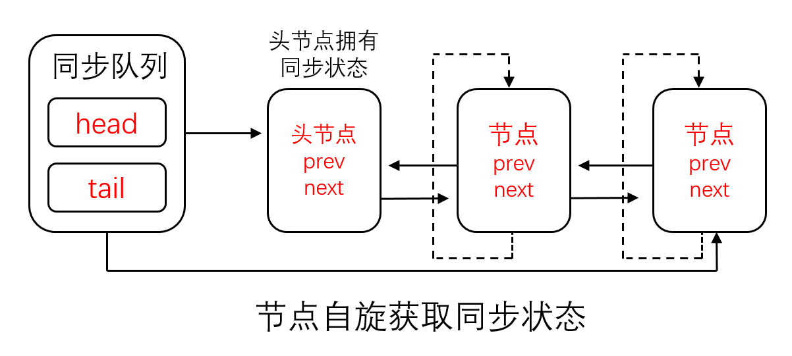
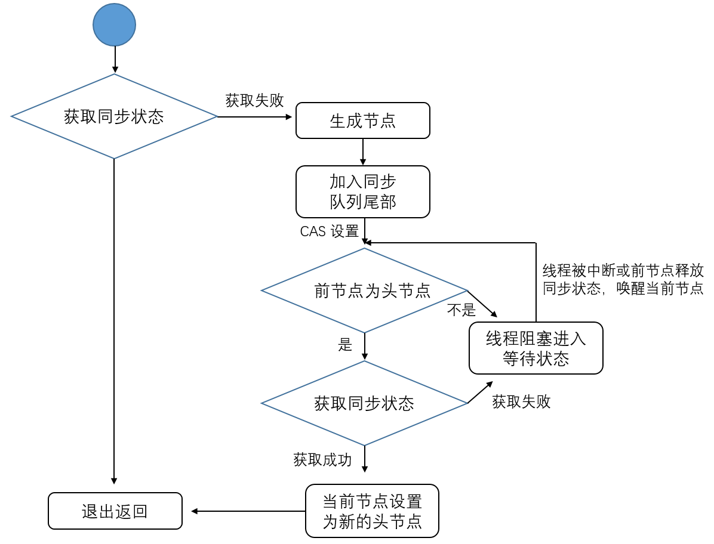

## 独占式获取锁和释放锁
　　独占式锁获取同步状态（锁），即同一时刻只有一个线程获取同步状态。acquire(int arg) 方法为 AQS 提供的模板方法，定义了获取锁的流程：

- tryAcquire，通过子类继承 AQS 框架来实现，独占式获取锁；
- [addWaiter](https://github.com/martin-1992/Java-Lock-Notes/tree/master/AQS%20%E6%A1%86%E6%9E%B6%E5%8D%B3%E5%85%B6%E5%AD%90%E7%B1%BB%E6%BA%90%E7%A0%81%E5%88%86%E6%9E%90/AbstractQueuedSynchronizer)，如果 tryAcquire 获取锁失败，返回 false，则调用该方法构造同步节点（模式为独占式 Node.EXCLUSIVE），并使用 CAS 将该节点加入到同步队列的尾部；
- acquireQueued，使该节点以死循环（自旋）方式获取同步状态，如果获取不到则阻塞节点中的线程。同步队列是遵循先进出原则，所以后续节点阻塞等待，依靠前节点出队唤醒后续节点，或者是阻塞线程被中断。
- selfInterrupt，产生一个中断。
  
  **注意，acquire 方法对中断不敏感，即对线程进行中断操作后，该节点（线程）会依然留在同步队列中等待获取同步状态（锁）。**
  
```java
public final void acquire(int arg) {
    if (!tryAcquire(arg) &&
        acquireQueued(addWaiter(Node.EXCLUSIVE), arg))
        selfInterrupt();
}

```

#### tryAcquire
　　由子类实现，尝试获取同步状态，获取成功则设置同步状态（state > 0，表示获取锁）并返回 true，否则返回 false。
  
```java
protected boolean tryAcquire(int arg) {
    throw new UnsupportedOperationException();
}
```

#### acquireQueued
　　节点进入同步队列后，会进行死循环（自旋）。acquireQueued 方法为一个自旋过程，每个节点都会进行自旋，当条件满足，获取到了同步状态后，才会从自旋过程中退出。<br />
　　以当前节点（线程）为例，通过 addWaiter 方法添加到同步队列的队尾后，会进入一个自旋过程（for 循环）。

- 首先获取当前节点的前一个节点；
- 先判断前节点是否为头节点，如果是，有两种情况，一种为头节点正在使用同步状态，另一种是已经释放了同步状态；
- 如果旧的头节点释放了同步状态，则当前节点尝试获取同步状态（公平锁的情况下，一般会成功获取，因为同一时刻只有一个线程获取同步状态）；
- 当前节点成功获取同步状态（锁）后，则将当前节点设置为新的头节点，删除旧的头节点；
- 当前节点的前节点不为头节点或获取同步状态失败后，会进入阻塞，等待头节点释放同步状态后，唤醒该节点，再尝试进行 tryAcquire 获取同步状态。
  
  
  
　　节点被唤醒，需要判断其前节点是否为头节点。唤醒节点的方法有两种，一种是头节点唤醒，另一种是节点的线程被中断而唤醒。下图为 acuqire() 方法的调用流程，即独占式同步状态获取流程：



```java
final boolean acquireQueued(final Node node, int arg) {
    boolean failed = true;
    try {
        // 中断标志
        boolean interrupted = false;
        // 自旋过程，为死循环
        for (;;) {
            // 获取前一个节点
            final Node p = node.predecessor();
            // 判断前节点是否为头节点，如果为头节点，存在两种情况，一种为头节点使用同步状态，另一种为头节点已经释放同步状态，为空
            // 节点，这时再次调用 tryAcquire 尝试获取同步状态
            if (p == head && tryAcquire(arg)) {
                // 当前节点获取同步成功，将当前节点设置为新的头节点
                setHead(node);
                // 删除前节点（旧的头节点）
                p.next = null; // help GC
                failed = false;
                return interrupted;
            }
            // 获取失败，中断标志为 true，当前线程被阻塞，等待前节点获取锁，唤醒当前线程
            if (shouldParkAfterFailedAcquire(p, node) &&
                parkAndCheckInterrupt())
                interrupted = true;
        }
    } finally {
        // 获取失败，则清除该节点
        if (failed)
            cancelAcquire(node);
    }
}
```

### selfInterrupt
　　当前线程产生一个中断。

```java
static void selfInterrupt() {
    Thread.currentThread().interrupt();
}
```
