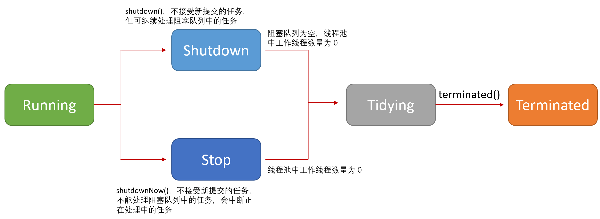

### 线程生命周期管理
　　ctl 是一个 AtomicInteger 对象，通过一个变量来维护两个信息，这样就不需要用锁来保证两个信息一致。<br />

- rs（runState），线程池的运行状态，用 int 变量的高 3 位表示（int 为 32 位的二进制）；
- wc（workerCount），线程池内有效线程的数量，用 int 变量的 低 29 位表示。

```java
    private final AtomicInteger ctl = new AtomicInteger(ctlOf(RUNNING, 0));
    // 32 位的高 3 位表示线程池的运行状态，32 - 3 = 29
    private static final int COUNT_BITS = Integer.SIZE - 3;
    // 32 位的低 29 位表示线程池内有效线程的数量，即 2^29 - 1
    private static final int CAPACITY   = (1 << COUNT_BITS) - 1;
```

　　由于 ctl 变量是由 rs（线程池的运行状态）和 wc（线程池内有效线程的数量）这两个组合而成，所以，知道这两个值，就可以使用 ctlOf() 方法计算出 ctl 的值。<br />
　　同理，这三个值，只要知道其中两个值，即可求出另外一个，这里都使用位运算来获取，提高性能。
  
```java
    // 计算 rs，线程池的运行状态，高 3 位是 1，低 29 位是 0 的一个 int 型的数
    private static int runStateOf(int c)     { return c & ~CAPACITY; }
    // 计算 wc，线程池内有效线程的数量，CAPACITY 为 2^29 - 1，高 3 位是 0，低 29 位是 1 的一个 int 型的数
    private static int workerCountOf(int c)  { return c & CAPACITY; }
    // 计算 ctl
    private static int ctlOf(int rs, int wc) { return rs | wc; }
```

### 线程池的运行状态

- **RUNNING（运行状态），** 能接受新提交的任务，并且也能处理阻塞队列中的任务；
- **SHUTDOWN（关闭状态），** 不接受新提交的任务，但可以继续处理阻塞队列中已保存的任务。在线程池处于 RUNNING 状态时，调用 shutdown() 方法会使线程池进入到该状态；
- **STOP（停止状态），** 不能接受新提交的任务，也不能处理阻塞队列中已保存的任务，并且会中断正在处理中的任务。在线程池处于 RUNNING 或 SHUTDOWN 状态时，调用 shutdownNow() 方法会使线程池进入到该状态；
- **TIDYING（清理状态），** 所有任务都执行完，且当前线程池已没有有效的线程，这个时候线程池的状态将会 TIDYING，将调用 terminated() 方法；
    1. 当线程池处于 SHUTDOWN 状态时，如果此后线程池内没有线程了并且阻塞队列内也没有待执行的任务了，线程池就会进入到该状态；
    2. 当线程池处于 STOP 状态时，如果此后线程池内没有线程了，线程池就会进入到该状态。
- **TERMINATED（终止状态），** terminated() 方法执行完后就进入该状态。



```java
    // runState is stored in the high-order bits
    // -1 << 29 = -536870912
    private static final int RUNNING    = -1 << COUNT_BITS;
    // 0 << 29 = 0
    private static final int SHUTDOWN   =  0 << COUNT_BITS;
    // 1 << 29 = 536870912，即 2^29
    private static final int STOP       =  1 << COUNT_BITS;
    // 2 << 29 = 1073741824，即 2^30
    private static final int TIDYING    =  2 << COUNT_BITS;
    // 3 << 29 = 1610612736
    private static final int TERMINATED =  3 << COUNT_BITS;
```

　　上面五个常量是按照从小到大的属性排列的，可通过比较大小判断出属于哪个状态。
  
```java
    private static boolean runStateLessThan(int c, int s) {
        return c < s;
    }

    private static boolean runStateAtLeast(int c, int s) {
        return c >= s;
    }
    // 
    private static boolean isRunning(int c) {
        return c < SHUTDOWN;
    }
```

### 构造函数 ThreadPoolExecutor
　　ThreadPoolExecutor 有四个构造函数，但其实都是调用同一个构造函数。

- **corePoolSize，核心线程。** 表示线程池中一直存活的最小线程数量。默认情况下，不会主动创建核心线程，而是有任务进来时，才会去创建；
- **maximumPoolSize，最大线程数。** 最大不能超过 CAPACITY 值，即 1 << 29 - 1。在通过方法 execute(Runnable) 提交一个任务到线程池时，会判断运行状态（RUNNING）的线程数量与核心线程数（corePoolSize）的大小；
    1. 当前线程池运行的线程少于 corePoolSize，则会创建一个核心线程来处理新任务；
    2. 当前线程池运行的线程大于 corePoolSize，会先尝试添加到阻塞队列 workQueue 中。如果队列已满，且线程池中的线程要小于 maximumPoolSize则会创建一个线程来执行。
- **keepAliveTime，空闲线程的等待时间。** 超过该时间，该线程就会停止工作；
    1. allowCoreThreadTimeOut=true，核心线程和非核心线程超时，停止工作，回收线程；
    2. allowCoreThreadTimeOut=false，非核心线程超时会停止工作，核心线程超时不会停止工作。
- **workQueue，阻塞队列。** 当线程池中的核心线程都在处理任务，新任务（Runnable）会先添加到阻塞队列中，它是一种类似 "生产者-消费者" 模型的队列；
- **threadFactory，线程工厂。** 用于创建线程，默认使用 Executors.defaultThreadFactory() 来创建线程工厂；
- **handler，拒绝策略。** 调用 handler 的 rejectedExecution 方法，用于拒绝新任务执行。

```java
    // 核心线程数
    private volatile int corePoolSize;
    // 最大线程数
    private volatile int maximumPoolSize;
    // 阻塞队列
    private final BlockingQueue<Runnable> workQueue;
    // 线程的空闲等待时间
    private volatile long keepAliveTime;
    // 线程工厂
    private volatile ThreadFactory threadFactory;
    // 拒绝策略
    private volatile RejectedExecutionHandler handler;

    public ThreadPoolExecutor(int corePoolSize,
                              int maximumPoolSize,
                              long keepAliveTime,
                              TimeUnit unit,
                              BlockingQueue<Runnable> workQueue,
                              ThreadFactory threadFactory,
                              RejectedExecutionHandler handler) {
        // 参数检验，不符则抛出异常
        if (corePoolSize < 0 ||
            maximumPoolSize <= 0 ||
            maximumPoolSize < corePoolSize ||
            keepAliveTime < 0)
            throw new IllegalArgumentException();
        if (workQueue == null || threadFactory == null || handler == null)
            throw new NullPointerException();
        // 赋值语句，将各参数分别保存到该类内部的 6 个成员字段
        this.acc = System.getSecurityManager() == null ?
                null :
                AccessController.getContext();
        this.corePoolSize = corePoolSize;
        this.maximumPoolSize = maximumPoolSize;
        this.workQueue = workQueue;
        this.keepAliveTime = unit.toNanos(keepAliveTime);
        this.threadFactory = threadFactory;
        this.handler = handler;
    }
```


#### remove

- 从队列移除该任务；
- [tryTerminate()](https://github.com/martin-1992/thread_pool_executor_analysis/blob/master/tryTerminate.md)，检查线程池是否满足终止运行条件，是则终止线程池的运行，不是则线程池继续运行。

```java
    public boolean remove(Runnable task) {
        boolean removed = workQueue.remove(task);
        tryTerminate(); // In case SHUTDOWN and now empty
        return removed;
    }
```
