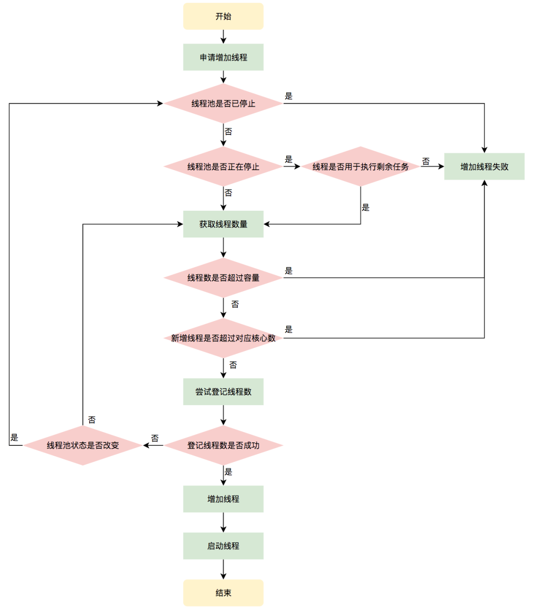

## addWorker
　　线程数 ctl 加一，将要执行的任务包装成 Worker 对象。调用该对象的 thread，执行 run 方法，具体流程如下。

- 获取 ctl 和线程池的当前状态，判断线程池是否还在工作、符合创建线程条件；
- 如线程池满足条件，还在工作，则使用自旋，判断线程池中的有效线程数是否小于最大容量，小于则使用 CAS 将 ctl 加一，即线程数加一；
- 将任务包装成 Worker 对象，添加到线程池 workers；
- 启动线程，调用 Worker 对象中的 thread，处理传进 Wokrer 对象的任务。



> -- 图片来自 [Java线程池实现原理及其在美团业务中的实践](https://mp.weixin.qq.com/s/baYuX8aCwQ9PP6k7TDl2Ww)

```java
    /**
    * 为 worker 的集合对象，即线程集合对象（线程池）
    */
    private final HashSet<Worker> workers = new HashSet<Worker>();
    
    /**
    * 线程池中当前线程数量，这里不用 volatile，是因为每次对其更新时，都上锁了，保证线程安全
    */
    private int largestPoolSize;

    private boolean addWorker(Runnable firstTask, boolean core) {
        retry:
        for (;;) {
            // 获取 ctl 和线程池的当前状态
            int c = ctl.get();
            int rs = runStateOf(c);

            // 检查线程池的状态，判断是否还在工作状态，不在则返回 false
            if (rs >= SHUTDOWN &&
                ! (rs == SHUTDOWN &&
                   firstTask == null &&
                   ! workQueue.isEmpty()))
                return false;
            
            // 使用自旋，保证线程数加一成功
            for (;;) {
                // 线程池中的有效线程数
                int wc = workerCountOf(c);
                // 线程数判断，当线程池中的线程数大于最大容量 CAPACITY，或者是大于 corePoolSize 或 maximumPoolSize，
                // 表示线程池已经不能在创建新线程，返回 false
                if (wc >= CAPACITY ||
                    wc >= (core ? corePoolSize : maximumPoolSize))
                    return false;
                // 使用 CAS 操作线程池，线程数量加一，CAS 成功的话则跳出循环
                if (compareAndIncrementWorkerCount(c))
                    break retry;
                // CAS 失败，则重新获取 ctl，检查线程池状态
                c = ctl.get();
                // 如果线程池的状态改变了，则重新循环操作
                if (runStateOf(c) != rs)
                    continue retry;
            }
        }
        
        // 任务是否成功启动标识
        boolean workerStarted = false;
        // 任务是否成功添加标识
        boolean workerAdded = false;
        Worker w = null;
        // 线程数加一成功后，将任务包装成 worker，创建线程，添加到线程池 workers
        try {
            // 根据参数 firstTask 来创建 Worker 对象，在 Worker 构造函数中会调用线程工厂创建一个线程
            w = new Worker(firstTask);
            // 获取线程对象
            final Thread t = w.thread;
            // ThreadFactory 构造出的 Thread 有可能是 null，做个判断
            if (t != null) {
                // 获取锁，并上锁
                final ReentrantLock mainLock = this.mainLock;
                mainLock.lock();
                try {
                    // 在锁住之后再重新检测一下检查线程池的状态
                    int rs = runStateOf(ctl.get());
                    // 线程池的状态为运行状态，或为关闭状态且 firstTask 为空时
                    if (rs < SHUTDOWN ||
                        (rs == SHUTDOWN && firstTask == null)) {
                        // 如线程已启动，则抛出异常
                        if (t.isAlive())
                            throw new IllegalThreadStateException();
                        // 将该 Worker 对象添加到 hashset 中
                        workers.add(w);
                        int s = workers.size();
                        // 更新线程池的当前线程数量
                        if (s > largestPoolSize)
                            largestPoolSize = s;
                        // 标识一下任务已经添加成功
                        workerAdded = true;
                    }
                } finally {
                    // 解锁
                    mainLock.unlock();
                }
                // 当 worker 已经添加到线程池 workers，则启动线程，调用 worker 中的 run 方法
                if (workerAdded) {
                    t.start();
                    workerStarted = true;
                }
            }
        } finally {
            // worker 启动失败，则回收该 worker
            if (! workerStarted)
                addWorkerFailed(w);
        }
        return workerStarted;
    }
    
    /**
    * 使用 CAS，线程数 + 1
    */
    private boolean compareAndIncrementWorkerCount(int expect) {
        return ctl.compareAndSet(expect, expect + 1);
    }
```

### addWorkerFailed
　　当添加 worker 失败时，则会上锁回收 worker：
    
- 从 workers 中删除掉对应的 worker；
- workCount 减一。

```java
    private void addWorkerFailed(Worker w) {
        final ReentrantLock mainLock = this.mainLock;
        mainLock.lock();
        try {
            if (w != null)
                workers.remove(w);
            decrementWorkerCount();
            tryTerminate();
        } finally {
            mainLock.unlock();
        }
    }
    
    private void decrementWorkerCount() {
        do {} while (! compareAndDecrementWorkerCount(ctl.get()));
    }
```


