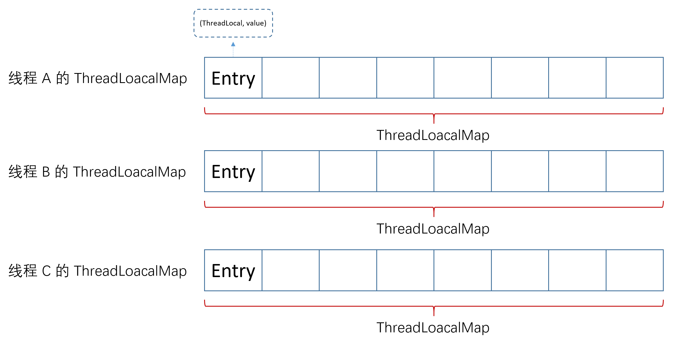

### ThreadLocal
　　ThreadLocalMap 结构如下图，Entry 的 key 为 ThreadLocal。即通过当前线程的 ThreadLocal 作为 key，从 ThreadLocalMap 中获取值。一个线程可以设置多个 ThreadLocal，即有多个 key，不建议设置多个 ThreadLocal，会造成哈希冲突。

- 每个线程都有各自的变量 threadLocals，类型为 ThreadLoacalMap，包含线程各自的本地变量；
- ThreadLoacalMap 是由 Entry 对象的数组组成的，通过哈希值（步长为 0x61c88647，取下一个哈希值），使用位运算来获取索引下标，所以数组长度必须为 2 的次方；
- Entry 对象，为弱引用（WeakReferences）。是由 Key 和 value 组成，key 为 ThreadLocal，value 为当前线程要存的本地变量值。因为是 Entry 是弱引用，存在 key 为 null（被 GC 回收了），但 value 不为 null，所以需要手动回收，防止内存泄漏。



```java
public class ThreadLocal<T> {

    private final int threadLocalHashCode = nextHashCode();

    /**
     * 哈希值，从 0 开始
     */
    private static AtomicInteger nextHashCode =
        new AtomicInteger();

    /**
     * 步长
     */
    private static final int HASH_INCREMENT = 0x61c88647;

    /**
     * 下个哈希值，根据一定步长获取的
     */
    private static int nextHashCode() {
        return nextHashCode.getAndAdd(HASH_INCREMENT);
    }

    /**
     * 用户自定义的初始值，在 get 方法获取不到时，会调用该方法返回自定义的初始值
     */
    protected T initialValue() {
        return null;
    }

    public static <S> ThreadLocal<S> withInitial(Supplier<? extends S> supplier) {
        return new SuppliedThreadLocal<>(supplier);
    }

    public ThreadLocal() {
    }
}
```

### 弱引用 WeakReference
　　Entry 中的 key（ThreadLocal）由弱引用修饰，在下次 GC 会被回收，即 **ThreadLocalMap 中的 Entry 的 key 指向 ThreadLocal 时，没有其它指向 ThreadLocal，ThreadLocal 会被回收。** 当 Entry 的 key（ThreadLocal）被回收变为 null，Entry 的 value 还在，这时需要手动回收。ThreadLocal 在 get() 和 set() 时，都会检查是否有 Entry 的 key 为 null，是则调用 [expungeStaleEntries](https://github.com/martin-1992/Java-Lock-Notes/blob/master/ThreadLocal/ThreadLocalMap/expungeStaleEntry.md) 进行回收。

```java
    static class Entry extends WeakReference<ThreadLocal<?>> {
        /** The value associated with this ThreadLocal. */
        Object value;

        Entry(ThreadLocal<?> k, Object v) {
            super(k);
            value = v;
        }
    }
```

- get，在获取值时，如果 key 为 null，则会调用 expungeStaleEntries 删除该 key 和对应的 Entry，防止内存泄漏。
- set，在设置值时，遇到哈希冲突，会采取线性探测法，往后遍历找到与该 key 相等的 Entry。如果遇到 key 为 null，则调用 expungeStaleEntries 删除该 key 和对应的 Entry，防止内存泄漏。

### [get](https://github.com/martin-1992/Java-Lock-Notes/blob/master/ThreadLocal/get.md)

- 获取当前线程绑定的 threadLocals，为 ThreadLocalMap；
- 将当前线程的 ThreadLoacal 作为 key，计算其哈希值；
- 根据哈希值（索引值），获取 ThreadLocalMap（Entry 数组）中对应的 Entry。Entry 由 ThreadLoacal 和要保存的值组成；
- 检查该 Entry 的 key 是否等于当前线程的 ThreadLoacal，是则获取该 Entry 的值。不是，则哈希冲突了，找到下一个 Entry，比较 key，继续获取；
- 当前线程的其他 ThreadLoacal，重复上面流程，计算 ThreadLoacal 的哈希值（索引值），从 ThreadLocalMap 中获取 Entry，获取 Entry 的值。

### [set](https://github.com/martin-1992/Java-Lock-Notes/blob/master/ThreadLocal/set.md)
　　流程和上面同样。

### [remove](https://github.com/martin-1992/Java-Lock-Notes/blob/master/ThreadLocal/remove.md)
　　从对象 Entry 数组中移除某个 key（ThreadLoacal）和对应的变量值。
