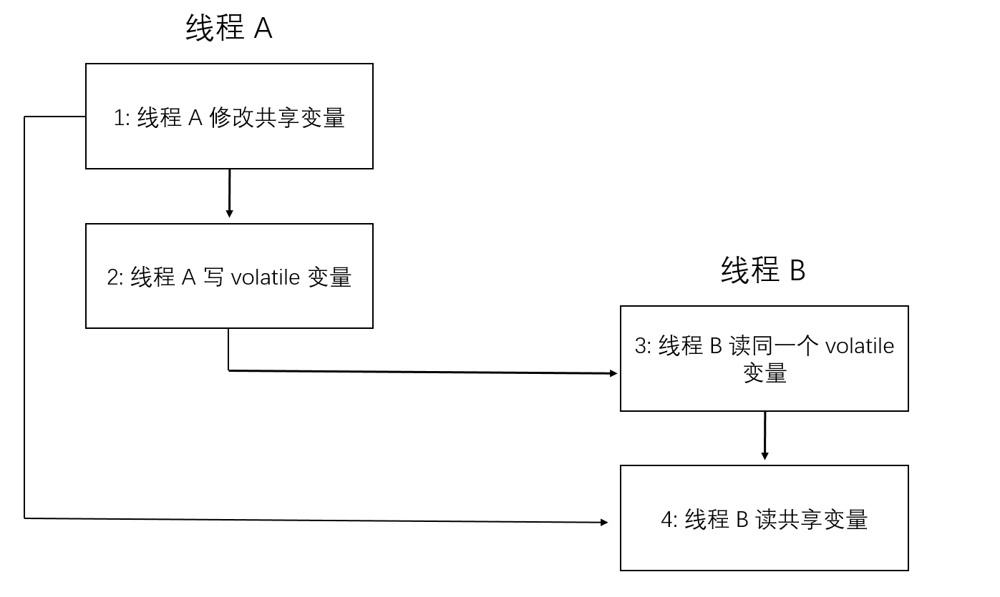
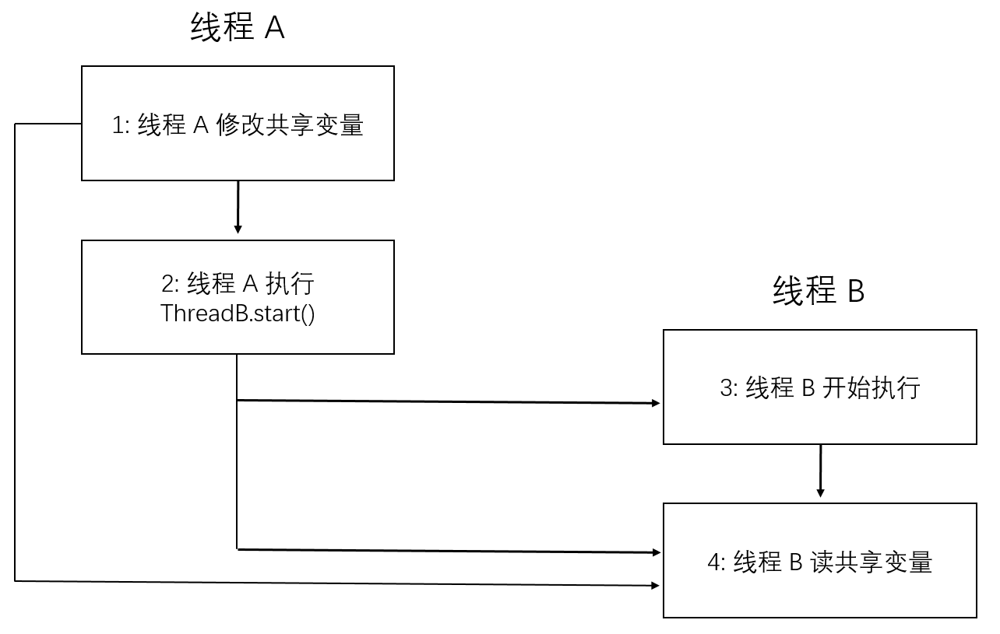
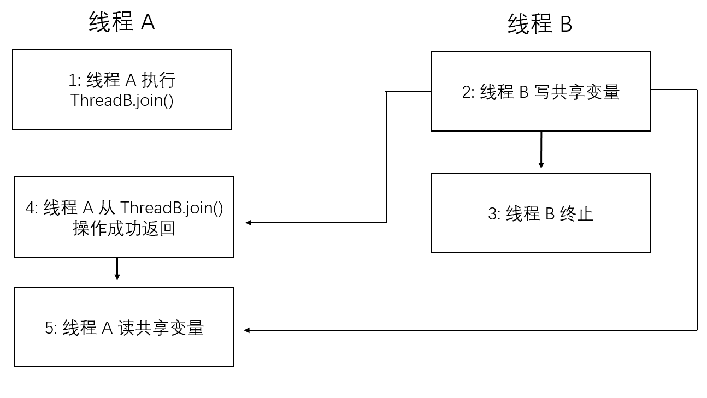

## happens-before 规则
　　表示前面一个操作的结果对后续操作是可见的。编译器优化会对 CPU 指令进行重排序，而 happens-before 约束了编译器的优化行为，即要求编译器的优化要遵守 happens-before 规则。

- **程序顺序规则。** 一个线程中的每个操作，happens-before 于该线程中的任意后续操作，即按照程序顺序执行，先执行第一行代码，在执行第二行代码，以此类推；
- **监视器锁规则。** 对一个锁的解锁，happens-before 于随后对这个锁的加锁。以 synchronized 关键字为例，它提供自动加锁和解锁，线程 A 在 synchronized 修饰的代码块中，将 x 更新为 12。执行完该代码块后，会自动解锁，然后线程 B 进入该代码块，能看到 x=12；
- **volatile 变量规则。** 对一个 volatile 域的写，happens-before  于任意（线程）后续对这个 volatile 的读。假设有两个线程，线程 A 读一个 volatile 变量，线程 B 写同一个 volatile 变量，则线程 B 的写操作是在线程 A 之前的；
- **传递性规则。** 如果 A happens-before B，且 B happens-before C，那么 A happens-before C；
- **start() 规则。** 如果线程 A 执行操作 ThreadB.start() （启动线程 B），那么 A 线程的 ThreadB.start() 操作 happens-before 于线程 B 中的任意操作；
- **join() 规则。** 如果线程 A 执行操作 ThreadB.join() 并成功返回，那么线程 B 中的任意操作 happens-before 于线程 A 从 ThreadB.join() 操作成功返回。

### 规则一、三、四的案例分析
　　先以 1、3、4 规则为例，下图为 volatile 写 - 读建立的 happens-before 关系图。



- 根据规则一，程序顺序规则。1 happens-before 2，3 happens-before 4；
- 根据规则三，volatile 变量规则。2 happens-before 3，对一个 volatile 变量的读，总是能看到（任意线程）之前对这个 volatile 变量最后的写入；
- 根据规则四，传递性规则。1 happens-before 2，3 happens-before 4，而 2 happens-before 3，所以 1 happens-before 4。

### 监视器锁规则的案例分析
　　假设 x = 10，线程 A 执行完如下代码，然后线程 B 执行该代码。根据监视器锁规则，线程 B 能看到之前线程 A 的操作。所以线程 B 能读到线程 A 进行操作的值，即 x = 11，然后线程 B 在 x=11 上加一，即 x = 12。

```java

// 使用 synchronized 会自动加锁
synchronized (this) {
    x += 1;
}
// 执行完代码块，则会自动解锁。
```


### start() 规则的案例分析
　　线程 A 通过执行 ThreadB.start() 来启动线程 B。线程 A 在启动线程 B 前修改了一些共享变量，线程 B 在启动后会读这些共享变量。



- 根据程序顺序规则。1 happens-before 2，3 happens-before 4；
- 根据 start() 规则，线程 A 的 ThreadB.start() 操作 happens-before 于线程 B 的任何操作，即 2 happens-before 4；
- 根据传递性规则，1 happens-before 2，2 happens-before 4，所以 1 happens-before 4，即线程 A 在执行 ThreadB.start() 之前对共享变量所做的修改，接下来在线程 B 开始执行后都将对线程 B 可见。

```java
Thread B = new Thread(() -> {
    // 线程 B 可看到线程 A 的操作，会打印 true
    if (x = 23) {
        System.out.println("true")
    }
});

// 线程 A 的操作，x 为共享变量
x = 23;
B.start();
```

### join 规则的案例分析
　　线程 A 执行 ThreadB.join() 来等待线程 B 终止，线程 B 在终止前对共享变量做了修改。线程 B 终止后，线程 A 继续执行。
  
- 根据 join() 规则，线程 B 的任何操作 happens-before 于线程 A 从 ThreadB.join() 操作成功返回，即 2 happens-before 4；
- 根据程序顺序规则，4 happens-before 5，所以线程 B 的任意操作（比如对共享变量的修改），线程 A 都能看到。



```java
// 在线程 A 中创建一个线程 B，修改共享变量 x，初始值为 10
Thread B = new Thread(() -> {
    x += 1;
});

// 启动线程 B
B.start();
// 等待线程 B 执行完
B.join();

// 继续执行线程 A 的操作，join() 规则，能看到线程 B 对共享变量 x 的操作
if (x == 11) {
    System.out.println("true");
}
```

### reference

- [Java 并发编程的艺术-方腾飞]()
