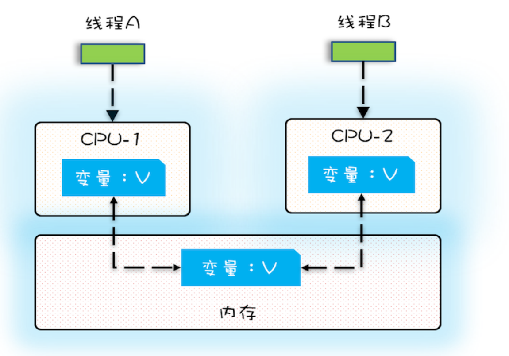

## volatile 原理分析
　　volatile 能保证可见性和禁止指令重排序，这要从处理器 CPU 结构说起。

### 多核 CPU 带来可见性问题
　　存储分为 CPU 缓存、电脑内存和磁盘设备，按照速度排名是 CPU 缓存 > 电脑内存 > 磁盘设备。一般的数据处理流程：

- 处理器 CPU 会从磁盘读取数据到电脑内存；
- CPU 不直接和电脑内存通信，再从电脑内存读取到处理器 CPU 的缓存进行操作；
- （读写）操作完成后，也不是立即写回电脑内存。而是先写到一个写缓冲区，当到一定数量时，在写回到电脑内存。如果修改一个操作，就写回到电脑内存，一是会降低效率。二是如果是对一个变量反复修改的话，能以最后一次修改为准。

　　在多核 CPU 处理数据情况下，每个 CPU 都有各自的缓存，这就会带来可见性问题。 
　　假设变量 V 存在电脑内存中，线程 A 使用 CPU-1 从电脑内存中读取变量 V 到 CPU-1 的缓存中，线程 B 使用 CPU-2 从电脑内存中读取 V 到 CPU-2 的缓存中，**即一个值会保存在多个 CPU 缓存中。** 如下图，来自 [Java 并发编程实战](https://time.geekbang.org/column/intro/159?code=yE7R5cKO5kMK5ONX2ztB0K-wA4vq6G8XKv27rKwK3o0%3D%5Cx26amp%3Butm_term%3DSPoster)。 
　　然后各自线程都对变量 V 进行修改操作，各自线程都看不到对方的操作，即可见性问题。

### volatile 保证可见性
　　明白可见性问题是因为一个值保存在多个 CPU 缓存中，volatile 修饰的共享变量在进行写操作时会使用 lock 命令（隐式的，在汇编代码中），其作用是：

- 将当前 CPU 缓存的数据写回到电脑内存，而不是先写到写缓冲区中；
- 使用缓存一致性协议，其它 CPU 检查该内存地址是否被修改，修改则重新到内存中获取最新的数据。

### refernce

- [Java 并发编程的艺术-方腾飞](https://item.jd.com/11740734.html)
- [Java 并发编程实战](https://time.geekbang.org/column/intro/159?code=yE7R5cKO5kMK5ONX2ztB0K-wA4vq6G8XKv27rKwK3o0%3D%5Cx26amp%3Butm_term%3DSPoster)
